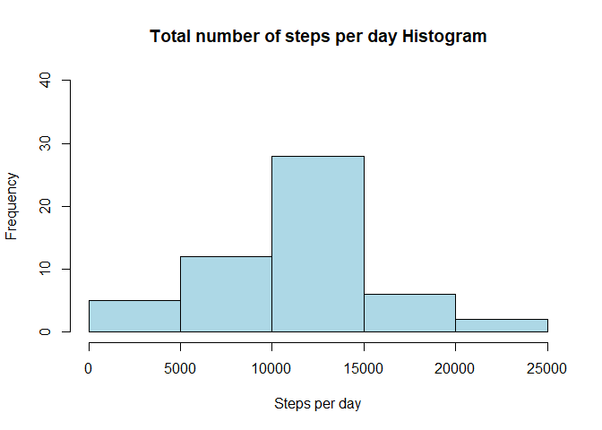
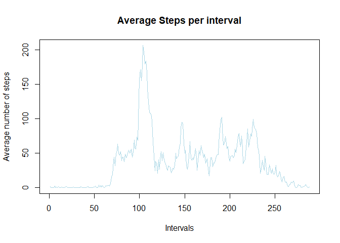
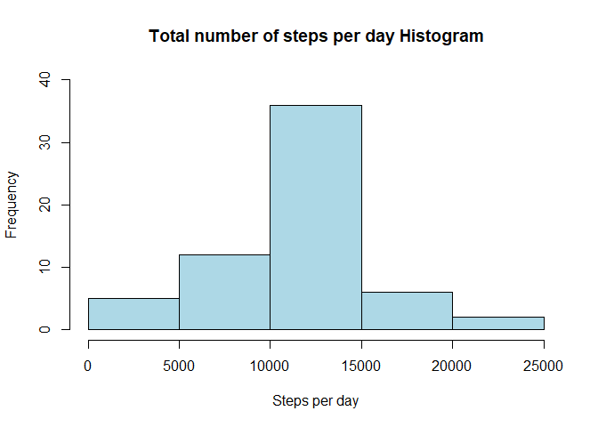
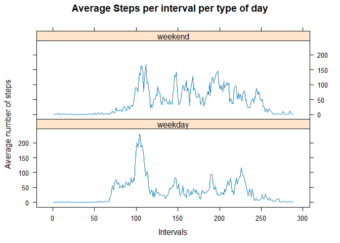

## Loading and preprocessing the data
In order to answer the questions proposed on the assignment, we will first load the data and change the variables to their
proper types.


```r
setwd("C:/Users/Aron/Documents/Data Science/Reproducible Research Course/RepData_PeerAssessment1")
data<- read.csv(file = "activity.csv",header = TRUE, sep = "," )
data$interval<-as.factor(data$interval)
data$date<-as.Date(data$date, "%Y-%m-%d" )
```

## What is mean total number of steps taken per day?

Next we want to know the mean and median of the total number of steps taken per day.

```r
sumstepsbyday<- tapply(data$steps, data$date, sum)
mean(sumstepsbyday, na.rm = T)
```

```
## [1] 10766.19
```

```r
median(sumstepsbyday, na.rm = T)
```

```
## [1] 10765
```

```r
hist(sumstepsbyday, ylim = c(0,40), xlab = "Steps per day", col = "lightblue", main = "Total number of steps per day Histogram")
```

<!-- -->

## What is the average daily activity pattern?
We also want to know the average number of steps per interval, plot it, and the interval with the higher average.


```r
averageperinterval<- tapply(data$steps,data$interval, mean, na.rm=T)   
intervals<-unique(data$interval)
plot(as.numeric(unique(data$interval)), averageperinterval, type="l", col="lightblue", main = "Average Steps per interval", xlab = "Intervals", ylab = "Average number of steps")  
```

<!-- -->

```r
max(averageperinterval)
```

```
## [1] 206.1698
```

```r
asdfaveint<-as.data.frame(averageperinterval)
asdfaveint$intervalsvector<-row.names(asdfaveint)
asdfaveint[asdfaveint$averageperinterval>205,] 
```

```
##     averageperinterval intervalsvector
## 835           206.1698             835
```

## Imputing missing values
Since the original dataset has some missing values and this could led to some bias being introduced into the calulations,  next we will calculate the total number of rows with NAs, use the mean of the intervals to fill in all
of the missing values in a new dataset, plot a histogram of the total number of steps per day and report the mean and median.


```r
summary(data)
```

```
##      steps             date               interval    
##  Min.   :  0.00   Min.   :2012-10-01   0      :   61  
##  1st Qu.:  0.00   1st Qu.:2012-10-16   5      :   61  
##  Median :  0.00   Median :2012-10-31   10     :   61  
##  Mean   : 37.38   Mean   :2012-10-31   15     :   61  
##  3rd Qu.: 12.00   3rd Qu.:2012-11-15   20     :   61  
##  Max.   :806.00   Max.   :2012-11-30   25     :   61  
##  NA's   :2304                          (Other):17202
```

```r
table(complete.cases(data))
```

```
## 
## FALSE  TRUE 
##  2304 15264
```

```r
meanbyinterval<-tapply(data$steps, data$interval, mean, na.rm=T )
meanbyintervalvector<-rep(meanbyinterval,61)
data$meanbyinterval<-meanbyintervalvector
data2<-data

for (i in 1:17568) {
        if (is.na(data$steps[i])) {
                
                data2$steps[i]<- data2$meanbyinterval[i]
        }
}
summary(data2)
```

```
##      steps             date               interval     meanbyinterval   
##  Min.   :  0.00   Min.   :2012-10-01   0      :   61   Min.   :  0.000  
##  1st Qu.:  0.00   1st Qu.:2012-10-16   5      :   61   1st Qu.:  2.486  
##  Median :  0.00   Median :2012-10-31   10     :   61   Median : 34.113  
##  Mean   : 37.38   Mean   :2012-10-31   15     :   61   Mean   : 37.383  
##  3rd Qu.: 27.00   3rd Qu.:2012-11-15   20     :   61   3rd Qu.: 52.835  
##  Max.   :806.00   Max.   :2012-11-30   25     :   61   Max.   :206.170  
##                                        (Other):17202
```

```r
table(complete.cases(data2))
```

```
## 
##  TRUE 
## 17568
```

```r
sumstepsbyday2<- tapply(data2$steps, data2$date, sum)
hist(sumstepsbyday2, ylim= c(0,40), xlab = "Steps per day", col = "lightblue", main = "Total number of steps per day Histogram")
```

<!-- -->

```r
mean(sumstepsbyday2)
```

```
## [1] 10766.19
```

```r
median(sumstepsbyday2)
```

```
## [1] 10766.19
```

We can see that imputing the missing values with the chosen strategy just increased the frequency of the most common 
range of steps perday, wich is 10,000 to 15,000.  Also de mean and median barely changed, if at all.


## Are there differences in activity patterns between weekdays and weekends?

Finally, we want to visualize the difference on the average steps by interval during the weekdays and the weekends.


```r
data2$weekday<-weekdays(data2$date)

for (i in 1:17568) {
        if (data2$weekday[i]== "sábado" | data2$weekday[i] == "domingo") {
                
                data2$businessday[i]<- "weekend"
        }
        else {
                data2$businessday[i]<- "weekday"
        }
}

dataweekday<-data2[data2$businessday=="weekday",]
yaxis<-(tapply(dataweekday$steps, dataweekday$interval, mean, na.rm=T))
xaxis<-unique(dataweekday$interval)
dataset1<-data.frame(xaxis,yaxis)
dataset1$businessday<-rep("weekday",288)

dataweekend<-data2[data2$businessday=="weekend",]
yaxis<-(tapply(dataweekend$steps, dataweekend$interval, mean, na.rm=T))
xaxis<-unique(dataweekend$interval)
dataset2<-data.frame(xaxis,yaxis)
dataset2$businessday<-rep("weekend", 288)

finaldataset<-rbind(dataset1,dataset2)
library(lattice)
par(mfrow=c(2,1))
xyplot(yaxis~as.numeric(xaxis)|businessday,finaldataset, type="l", layout=c(1,2), xlab = "Intervals", ylab =  "Average number of steps", main= "Average Steps per interval per type of day")
```

<!-- -->

